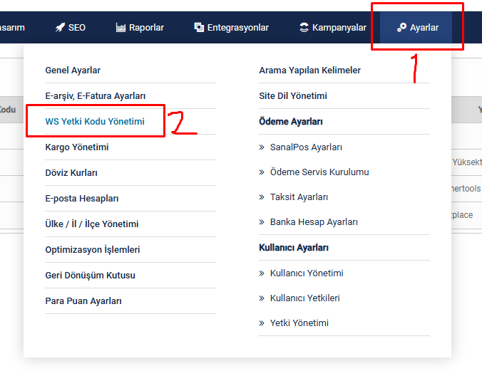

# !!!!KÜTÜPHANE HALA GELİŞTİRİLMEKTE OLDUĞU İÇİN BAZI KODLAR DEĞİŞEBİLİR

## Ticimax Php
Bu kütüphane ile ticimax entegrasyonu yapabilirsiniz.

## Kurulum
Aşağıdaki komutu terminale yazdığınızda kütüphaneyi "vendor" klasörü olarak indirecektir. Aşağıdaki komutu kullanabilmek için composer bilgisayarınızda kurulu olmalıdır.

https://getcomposer.org/download/

```sh
composer require hasokeyk/ticimax-php
```

## Ticimax Ayarları - Yetki Kodu Alma
Ticimax admin paneline girdikten sonra. Aşağıdaki adımları izleyerek "Ws Yetki Kodu Yönetimi" sayfasını açın.



Açılan sayfadan "Yeni Ekle" butonuna tıklayın.

Gerekli formu doldurun. Oluşan keyi sonradan da görebilirsiniz.

## Örnek Kod

```php
<?php

	use Hasokeyk\Ticimax\Ticimax;

	require_once (__DIR__)."/vendor/autoload.php";

	$domain = "https://xxxxyyyyzzzz.com"; //TİCİMAX WEBSİTE ADI
	$key    = "XXXXXXXXXXXXXXXXXXXXXXXXXXXXXXXXXXX"; //OLUŞTURDUĞUNUZ KEY

	$ticimax = new Ticimax($domain, $key);

	$ticimax_categories = $ticimax->categories();

	$get_categories = $ticimax_categories->get_categories();
	print_r($get_categories);
```

daha fazla örnek kod için "[example](https://github.com/Hasokeyk/ticimax-php/tree/main/example])" klasörüne bakınız